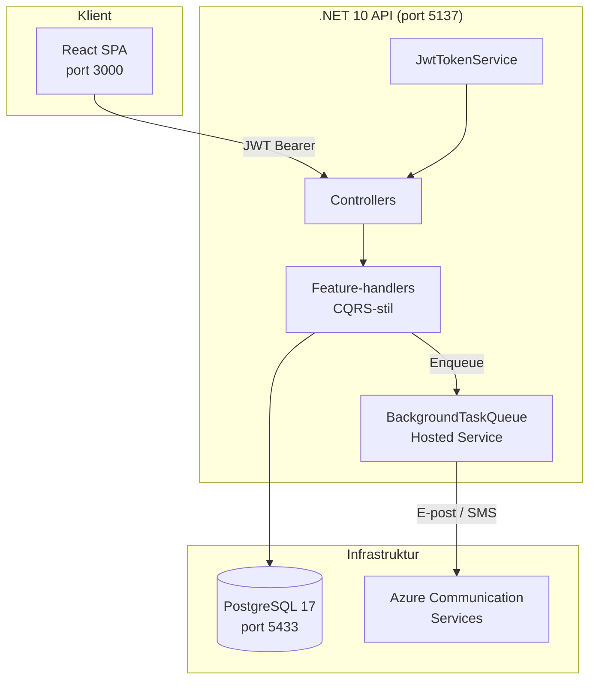
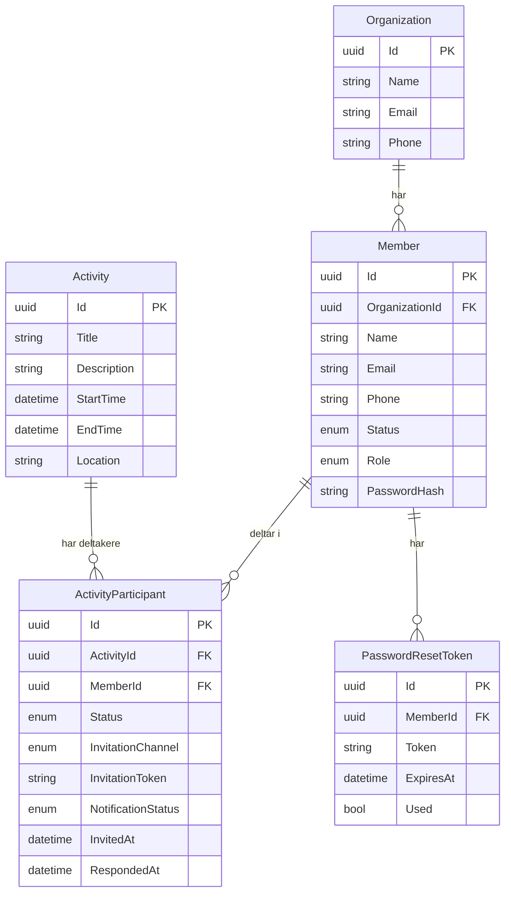
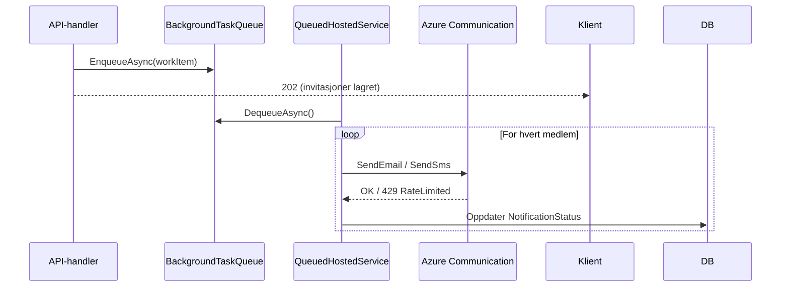

# Systemarkitektur — Hitti

Hitti er bygget som en multi-tenant SaaS-plattform der hver forening er en selvstendig leietaker (tenant) med sine egne medlemmer og aktiviteter. Isolasjonen skjer ved at alle relevante tabeller inneholder en `OrganizationId`, og at alle API-kall fra innloggede brukere filtrerer på den organisasjonen som er kodet inn i JWT-tokenet. Arkitekturen er bevisst enkel: ett API, ett SPA, én database.

## Innholdsfortegnelse

1. [Overordnet arkitektur](#overordnet-arkitektur)
2. [Multi-tenant isolasjon](#multi-tenant-isolasjon)
3. [Roller og tilgangskontroll](#roller-og-tilgangskontroll)
4. [Komponentoversikt](#komponentoversikt)
5. [Datamodell](#datamodell)
6. [Notifikasjonsinfrastruktur](#notifikasjonsinfrastruktur)
7. [Teknologivalg](#teknologivalg)

---

## Overordnet arkitektur



Alle tre tjenester kjører i Docker-containere koordinert av `docker-compose.yml`.
Frontend er bygget som en statisk React-app servert av nginx.

---

## Multi-tenant isolasjon

Hitti bruker en **shared database, shared schema**-strategi: alle leietakere deler samme PostgreSQL-instans og tabeller. Isolasjonen håndheves i applikasjonslaget.

**Slik fungerer det:**

- `OrganizationEntity` er rot-entiteten for en leietaker.
- `MemberEntity` har en `OrganizationId` fremmednøkkel.
- `ActivityEntity` henter organisasjonstilhørighet via innlogget admin (JWT-claim `org`).
- Alle spørringer som returnerer data til innlogget bruker filtrerer eksplisitt på `organizationId` hentet fra JWT-tokenet.

```
Organization (1) ──── (*) Member
                              │
                              └── (*) ActivityParticipant ──── (*) Activity
```

**Det finnes ingen teknisk gardering i databasen** (f.eks. Row Level Security). Korrekt filtrering er et applikasjonskrav og må ivaretas i alle nye handlere.

---

## Roller og tilgangskontroll

Hitti har to roller:

| Rolle | Beskrivelse |
|---|---|
| **Admin** | Logger inn med passord. Administrerer medlemmer, aktiviteter og invitasjoner. Får JWT-token. |
| **Member** | Har ingen innlogging. Mottar invitasjoner og svarer via unik token-URL (`/svar/:token`). |

Tilgangskontroll på API-endepunkter:

- `[Authorize]` — krever gyldig JWT (kun Admin kan oppnå dette).
- `[AllowAnonymous]` — åpne endepunkter: `/svar/:token`, `forgot-password`, `reset-password`, og `register`.

Et `Member` med rollen `Admin` i databasen har altså et `PasswordHash` satt og kan logge inn. Vanlige medlemmer har `PasswordHash = null` og kan aldri logge inn, uavhengig av hva de prøver.

---

## Komponentoversikt

### Backend — Features

Backenden er organisert etter vertikale feature-skiver (Vertical Slice Architecture). Hver feature har egne kontrollere, handlere og kontrakter.

| Feature | Ansvar |
|---|---|
| `Auth` | Innlogging, registrering, glemt/tilbakestill passord |
| `Activities` | CRUD for aktiviteter, utsending og mottak av invitasjoner |
| `Members` | CRUD for medlemmer innen en organisasjon |
| `Organizations` | Oppdatering av organisasjonsdetaljer |

Handlere er navngitt etter kommando/spørring-mønster: `CreateActivityHandler`, `GetAllMembersHandler` osv. De injiseres direkte i kontrollere uten eget mediator-bibliotek.

### Backend — Infrastructure

| Modul | Ansvar |
|---|---|
| `Database` | EF Core DbContext, entiteter, migrasjoner, konfigurasjoner |
| `Authentication` | `JwtTokenService`, `JwtOptions`, middleware-oppsett |
| `BackgroundTasks` | In-memory `Channel`-basert kø, `QueuedHostedService` |
| `Notifications` | `INotificationService` / `AzureNotificationService` |

### Frontend

Frontend er en enkel React + Vite SPA. Den kommuniserer med backenden via REST. Ingen state management-bibliotek er lagt til ennå (per mai 2026).

---

## Datamodell



**Enum-verdier:**

- `MemberStatus`: `Active`, `Inactive`
- `MemberRole`: `Admin`, `Member`
- `ParticipantStatus`: `Invited`, `Accepted`, `Declined`
- `InvitationChannel`: `Email`, `Sms`
- `NotificationStatus`: `Pending`, `Sent`, `Failed`

---

## Notifikasjonsinfrastruktur

Utsending av e-post og SMS skjer **asynkront** via en in-memory bakgrunnskø:



- Køen er in-memory (`System.Threading.Channels`). Den tømmes ikke på tvers av restarter.
- `QueuedHostedService` prosesserer ett arbeidselement av gangen.
- Se [invitasjonsflyt](../features/invitations.md) for retry-logikk.

---

## Teknologivalg

| Valg | Alternativ vurdert | Begrunnelse |
|---|---|---|
| .NET 10 / C# | Node.js | Sterk typesikkerhet, god EF Core-støtte, familiaritet |
| PostgreSQL | SQLite, MySQL | Robust, god JSON-støtte, UUID-native |
| EF Core + migrasjoner | Dapper + SQL-filer | Raskere utvikling, trygg skjemaendring |
| Azure Communication Services | SendGrid, Twilio | Norsk datalagring, samlet e-post+SMS-leverandør |
| JWT uten refresh-token | Session, refresh-token | Lavere kompleksitet — admin-brukere, ikke sluttbrukere |
| In-memory Channel-kø | Hangfire, Azure Service Bus | Ingen ekstern avhengighet, tilstrekkelig for dagens volum |
| React + Vite | Next.js, Angular | Kjent stack, rask oppstart, ingen SSR-behov |
| Shared schema multi-tenancy | Per-tenant database | Enklere drift og utvikling på tidlig stadium |
