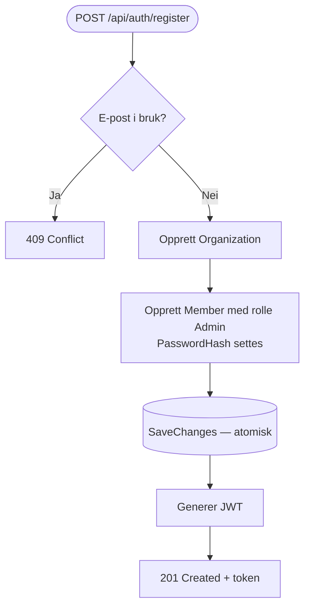
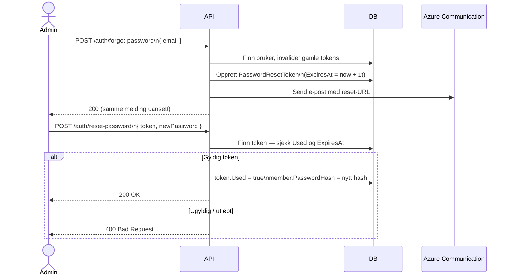

# Autentisering og tilgangskontroll

Hitti bruker JWT (JSON Web Tokens) for å autentisere admin-brukere. Kun medlemmer med rollen `Admin` og et satt passord kan logge inn. Vanlige medlemmer har ingen innlogging — de interagerer med systemet utelukkende via personlige invitasjonslenker. Registrering av ny organisasjon oppretter org og admin-bruker atomisk i én transaksjon.

## Innholdsfortegnelse

1. [Innlogging](#innlogging)
2. [Registrering](#registrering)
3. [JWT-token](#jwt-token)
4. [Glemt passord](#glemt-passord)
5. [Tilbakestill passord](#tilbakestill-passord)
6. [Tilgangskontroll på API-nivå](#tilgangskontroll-på-api-nivå)
7. [Sikkerhetsprinsipper](#sikkerhetsprinsipper)

---

## Innlogging

**Endepunkt:** `POST /api/auth/login`

**Request:**
```json
{
  "email": "admin@forening.no",
  "password": "SikkertPassord123!"
}
```

### Funksjon: Vellykket innlogging

**Gitt** at en bruker finnes i databasen med det angitte e-postadressen, et satt `PasswordHash`, og rollen `Admin`  
**Når** brukeren sender korrekt e-post og passord til `/api/auth/login`  
**Så** returneres et JWT-token og brukerinformasjon med HTTP 200

### Funksjon: Innlogging avvist

**Gitt** at e-postadressen ikke finnes, passordet er feil, eller brukeren har rollen `Member`  
**Når** innloggingsforsøket mottas  
**Så** returneres HTTP 401 med generisk feilmelding (ikke spesifikt hvilken sjekk som feilet)

**Viktig:** API returnerer alltid samme feilmelding uavhengig av om e-post, passord eller rolle feilet. Dette er bevisst — for å hindre informasjonslekkasje om hvilke e-postadresser som finnes.

---

## Registrering

**Endepunkt:** `POST /api/auth/register`

Registrering er den eneste måten å opprette en ny organisasjon på. Endepunktet er åpent (`[AllowAnonymous]`).

**Request:**
```json
{
  "organizationName": "Oslofoten Klatreklubb",
  "organizationEmail": "post@klatreklubb.no",
  "organizationPhone": "22 33 44 55",
  "adminName": "Kari Nordmann",
  "adminEmail": "kari@klatreklubb.no",
  "adminPhone": "98765432",
  "password": "SikkertPassord123!"
}
```

### Funksjon: Opprett organisasjon og admin

**Gitt** at e-postadressen ikke allerede er i bruk i systemet  
**Når** registreringsforespørselen mottas  
**Så** opprettes `OrganizationEntity` og `MemberEntity` (med rolle `Admin`) i én `SaveChanges`-kall, og et JWT-token returneres med HTTP 201



**Funksjon: E-post allerede i bruk**

**Gitt** at en annen bruker allerede er registrert med samme e-postadresse  
**Når** registreringsforespørselen mottas  
**Så** returneres HTTP 409 Conflict uten å endre databasen

---

## JWT-token

Tokenet inneholder følgende claims:

| Claim | Verdi |
|---|---|
| `sub` | `MemberId` (UUID) |
| `name` | Adminens fulle navn |
| `email` | Adminens e-postadresse |
| `role` | `Admin` |
| `org` | `OrganizationId` (UUID) — brukes til tenant-isolasjon |
| `jti` | Tilfeldig UUID — unik per token |

**Konfigurasjon:**

| Parameter | Standardverdi (dev) |
|---|---|
| Algoritme | HMAC-SHA256 |
| Levetid | 480 minutter (8 timer) |
| Issuer | `hitti` |
| Audience | `hitti-frontend` |

**Ingen refresh-token:** Når tokenet utløper må brukeren logge inn på nytt. Dette er et bevisst valg for å holde autentiseringslogikken enkel — Hitti-admins er interne brukere med lang økt-levetid (8 timer).

Frontend sender tokenet som `Authorization: Bearer <token>` på alle beskyttede kall.

---

## Glemt passord

**Endepunkt:** `POST /api/auth/forgot-password`

**Krav:** Åpent endepunkt (`[AllowAnonymous]`).

**Request:**
```json
{
  "email": "admin@forening.no"
}
```

### Funksjon: Be om tilbakestillingslenke

**Gitt** at en admin-bruker med angitt e-post finnes og har `PasswordHash` satt  
**Når** forespørselen mottas  
**Så** invalideres alle eksisterende ubrukte reset-tokens for brukeren, et nytt kryptografisk tilfeldig token opprettes med 1 times utløpstid, og en e-post med tilbakestillingslenke sendes

**Funksjon: Ukjent e-postadresse**

**Gitt** at e-postadressen ikke finnes i systemet (eller tilhører et vanlig Medlem uten passord)  
**Når** forespørselen mottas  
**Så** returneres HTTP 200 med identisk melding som ved suksess — ingen informasjonslekkasje

**Tilbakestillingslenke format:**
```
{App:BaseUrl}/tilbakestill-passord?token={token}
```

**Token-egenskaper:**
- Generert med `RandomNumberGenerator.GetBytes(32)` — 256 bits entropi.
- URL-safe Base64 (erstatter `+`→`-` og `/`→`_`).
- Utløper **1 time** etter opprettelse.
- Markeres som `Used = true` etter bruk — kan ikke gjenbrukes.
- Kun ett aktivt token per bruker til enhver tid (tidligere tokens invalideres).

---

## Tilbakestill passord

**Endepunkt:** `POST /api/auth/reset-password`

**Request:**
```json
{
  "token": "<token-fra-e-post>",
  "newPassword": "NyttSikkertPassord456!"
}
```

### Funksjon: Gyldig token — nytt passord settes

**Gitt** at token eksisterer i databasen, ikke er brukt, og ikke har utløpt  
**Når** forespørselen mottas  
**Så** markeres tokenet som `Used = true`, `PasswordHash` oppdateres med nytt hash, og HTTP 200 returneres

### Funksjon: Ugyldig eller utløpt token

**Gitt** at token ikke finnes, allerede er brukt, eller `ExpiresAt` er passert  
**Når** forespørselen mottas  
**Så** returneres HTTP 400 med beskjed om å be om ny tilbakestillingslenke



---

## Tilgangskontroll på API-nivå

| Endepunkt | Tilgang |
|---|---|
| `POST /api/auth/login` | Åpen |
| `POST /api/auth/register` | Åpen |
| `GET /api/auth/me` | Krever JWT |
| `POST /api/auth/forgot-password` | Åpen |
| `POST /api/auth/reset-password` | Åpen |
| `GET /api/rsvp/{token}` | Åpen (token er autentisering) |
| `GET /api/activities/*` | Krever JWT |
| `POST /api/activities/*` | Krever JWT |
| `GET /api/members/*` | Krever JWT |
| `POST /api/members/*` | Krever JWT |
| `GET/PUT /api/organizations/*` | Krever JWT |

---

## Sikkerhetsprinsipper

- **Passord-hashing:** `IPasswordHasher<object>` fra ASP.NET Core Identity — PBKDF2 med HMACSHA256, 100 000 iterasjoner (standard i .NET 8+).
- **Ingen enumereringsangrep:** Innlogging og glemt-passord returnerer identiske meldinger uavhengig av om brukeren finnes.
- **Tenant-isolasjon:** `OrganizationId` fra JWT-token brukes som filter på alle databasespørringer — en admin kan ikke lese data fra en annen organisasjon.
- **Token-entropi:** Reset-tokens har 256 bits entropi (32 bytes). Invitasjons-tokens har 192 bits entropi (24 bytes).
- **Én aktiv reset-token:** Nye tilbakestillingsforespørsler invaliderer alle ubrukte tokens. Dette hindrer at gamle lenker fortsatt fungerer etter at en ny er bedt om.
