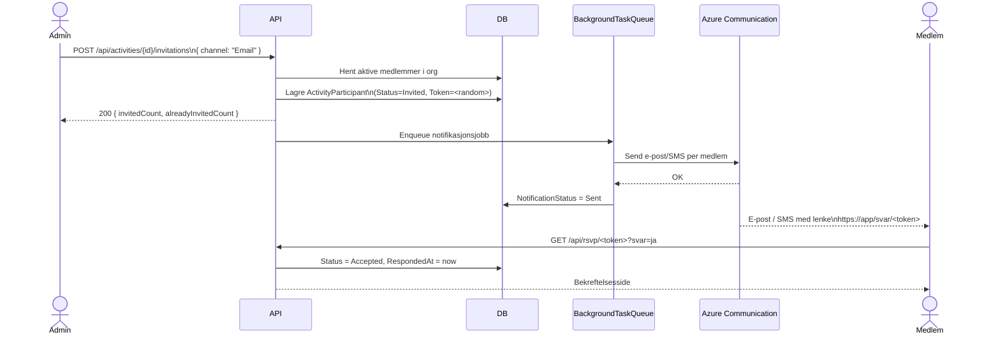
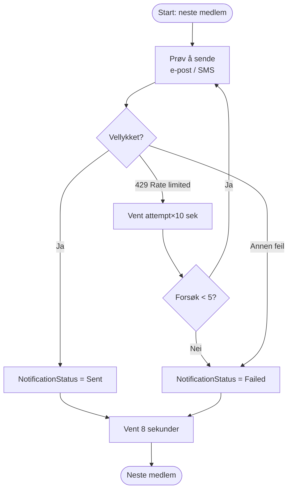

# Invitasjons- og RSVP-flyt

Hitti lar admin invitere alle aktive medlemmer i organisasjonen til en aktivitet med ett klikk. Hvert medlem får en personlig lenke via e-post eller SMS og kan svare uten å logge inn. Admin følger opp svarstatusene direkte i grensesnittet og kan sende på nytt til de som ikke har svart.

## Innholdsfortegnelse

1. [Overordnet flyt](#overordnet-flyt)
2. [Send invitasjoner](#send-invitasjoner)
3. [Bakgrunnskø og retry-logikk](#bakgrunnskø-og-retry-logikk)
4. [RSVP — svar på invitasjon](#rsvp--svar-på-invitasjon)
5. [Send invitasjon på nytt](#send-invitasjon-på-nytt)
6. [Utviklingsmodus](#utviklingsmodus)
7. [Statusmodell](#statusmodell)

---

## Overordnet flyt



---

## Send invitasjoner

**Endepunkt:** `POST /api/activities/{activityId}/invitations`

**Krav:** Innlogget Admin (`[Authorize]`). `OrganizationId` leses fra JWT-token.

**Request:**
```json
{
  "channel": "Email"
}
```
`channel` kan være `Email` eller `Sms`.

### Funksjon: Send invitasjoner til aktivitet

**Gitt** at en Admin er innlogget og en aktivitet eksisterer i organisasjonen  
**Når** Admin sender `POST /api/activities/{id}/invitations` med ønsket kanal  
**Så** opprettes det en `ActivityParticipant`-rad per aktive medlem som ikke allerede er invitert, hvert med et unikt `InvitationToken`, og en bakgrunnskøjobb enqueues for utsending

**Token-generering:**
```
32 kryptografisk tilfeldige bytes → Base64URL → 32 tegn
```
Generert med `RandomNumberGenerator.GetBytes(24)`, URL-safe formatert (`+`→`-`, `/`→`_`).

**RSVP-URL format:**
```
{App:BaseUrl}/svar/{token}
```

**Response:**
```json
{
  "invitedCount": 18,
  "alreadyInvitedCount": 2
}
```

**Idempotens:** Medlemmer som allerede finnes i `ActivityParticipants` for aktiviteten hoppes over. Det er trygt å kalle endepunktet flere ganger.

---

## Bakgrunnskø og retry-logikk

Selve utsendingen skjer **etter** at API-kallet har returnert. Arbeidet legges i en in-memory `Channel`-basert kø og prosesseres av `QueuedHostedService`.



**Retry-regler for utsending (SendInvitationsHandler):**

- Maks **5 forsøk** per medlem.
- Ved HTTP 429 (rate limit): exponential-lignende backoff — `attempt × 10` sekunder.
- Ved andre feil: avbryt umiddelbart uten retry.
- Etter hvert vellykket (eller mislykket) utsendingsforsøk ventes det **8 sekunder** før neste medlem prosesseres. Dette for å skåne Azure Communication Services-kvoten.

**Retry-regler for resending (ResendInvitationHandler):**

- Maks **5 forsøk** per resending.
- Fast 1 sekunds ventetid mellom forsøk (ingen differensiering på feiltype).

**Viktig:** Køen er **in-memory**. Applikasjonsrestart mister jobbene som ennå ikke er prosessert. Vedvarende kø (f.eks. Hangfire) er ikke implementert per mai 2026.

---

## RSVP — svar på invitasjon

**Endepunkt:** `GET /api/rsvp/{token}?svar=ja` eller `?svar=nei`

**Krav:** Ingen autentisering (`[AllowAnonymous]`). Token er bærer av identitet.

### Funksjon: Svar på invitasjon

**Gitt** at et medlem har mottatt en invitasjon og klikker lenken i meldingen  
**Når** nettleseren åpner `/svar/{token}?svar=ja` (eller `?svar=nei`)  
**Så** oppdateres `ActivityParticipant.Status` til henholdsvis `Accepted` eller `Declined`, `RespondedAt` settes til nåtidspunkt, og API returnerer aktivitetsinformasjon for bekreftelsesvisning

**Funksjon: Ugyldig token**

**Gitt** at en URL inneholder et token som ikke finnes i databasen  
**Når** API mottar forespørselen  
**Så** returneres `404 Not Found` og ingen data endres

**Overskriving av svar:** Et medlem kan svare igjen med en annen lenke og overskrive tidligere svar. Det finnes ingen lås på RSVP-feltet.

---

## Send invitasjon på nytt

**Endepunkt:** `POST /api/activities/{activityId}/participants/{participantId}/resend`

**Krav:** Innlogget Admin. Verifiserer at deltaker tilhører adminens organisasjon.

### Funksjon: Resend til enkelt-deltaker

**Gitt** at en admin ser at en deltaker har `NotificationStatus = Failed` eller ikke har svart  
**Når** admin trykker "Send på nytt" og API mottar resend-forespørselen  
**Så** enqueues en ny notifikasjonsjobb for samme deltaker med samme token og kanal, og `NotificationStatus` oppdateres til `Sent` eller `Failed` etter forsøket

Tokenet gjenbrukes — lenken som allerede ble sendt er fortsatt gyldig.

---

## Utviklingsmodus

Når konfigurasjonsverdien `App:DevRedirectEmail` er satt, omdirigeres **alle** notifikasjoner — uavhengig av kanal (e-post eller SMS) — til den angitte adressen.

E-posten som sendes i dev-modus inneholder:
- Et banner som viser opprinnelig mottaker og kanal.
- Samme HTML-innhold og RSVP-knapper som produksjons-e-posten.

Dette gjør det mulig å teste hele flyten uten å sende meldinger til ekte telefonnummer eller e-postadresser.

---

## Statusmodell

### ParticipantStatus

| Verdi | Beskrivelse |
|---|---|
| `Invited` | Invitasjon er opprettet, ikke nødvendigvis sendt ennå |
| `Accepted` | Medlemmet har svart ja |
| `Declined` | Medlemmet har svart nei |

### NotificationStatus

| Verdi | Beskrivelse |
|---|---|
| `Pending` | Jobb er enqueued, ikke sendt ennå |
| `Sent` | Melding bekreftet levert av Azure Communication |
| `Failed` | Alle forsøk feilet — se logg for detaljer |

Admin kan se `NotificationStatus` per deltaker og kan manuelt trigge resending for de med status `Failed`.
